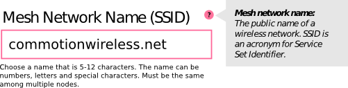

# Writing Extensions

## Intro

This documentation will walk you through how to create a Commotion Client extension using the provided templates and Qt Designer. This documentation follows the development of the core extension responsable for managing Commotion configuration files. You can find the code for the version of the extension built in this tutorial in the "docs/extensions/tutorial" folder. The current Commotion config extension can be found in "commotion_client/extension/core/config_manager." This tutorial will not keep up to date with this extension as it evolves unless there are core changes in the commotion API that require us to update sections to maintain current with the API.

## Design

Commotion comes with a [JSON](http://json.org/) based network configuration file. This file contains the mesh settings for a Commotion network. These profiles currently contain the following values.
```
{
  "announce": "true",
  "bssid": "02:CA:FF:EE:BA:BE",
  "bssidgen": "true",
  "channel": "5",
  "dns": "208.67.222.222",
  "domain": "mesh.local",
  "encryption": "psk2",
  "ip": "100.64.0.0",
  "ipgen": "true",
  "ipgenmask": "255.192.0.0",
  "key": "c0MM0t10n!r0cks",
  "mdp_keyring": "/etc/commotion/keys.d/mdp.keyring/serval.keyring",
  "mdp_sid": "0000000000000000000000000000000000000000000000000000000000000000",
  "mode": "adhoc",
  "netmask": "255.192.0.0",
  "serval": "false",
  "ssid": "commotionwireless.net",
  "type": "mesh"
  "routing": "olsr"
  "family":"1pv4"
}
```

Any good user interface starts with a need and a user needs assessment. We *need* an interface that will allow a user to understand, and edit a configuration file. Our initial *user needs assessment* revealed two groups of users.

Basic Users:
  * These users want to be able to download, or be given, a config file and use it to connect to a network with the least ammount of manipulation.
  * These users want interfaces based upon tasks, not configuration files, when they do modify their settings.
  * When these users download a configuration file they want it to be named somthing that allows it to be easy to identify later/

Intermediate/Advanced Users
  * These users desire all the attributes that are listed under the *basic user.*
  * These users also want an interface where they can quickly manipulate all the network settings quickly without having to worry about abstractions that have been layered on for new users.
    * These abstractions make advanced users feel lost and frustrated because they know what they want to do, but can not find the "user friendly" term that pairs with the actual device behavior. 


Our needs assessment identified two different extensions. One extension is a device configuration interface that abstracts individual networking tasks into their component parts for easy configuration by a new user. The second extension is a configuration file loader, downloader,  editor, and applier. This second extension is what we will build here.

The Commotion [Human Interface Guidelines](http://commotionwireless.net/developer/hig/key-concepts) have some key concepts for user interface that we should use to guide our page design.

**Common Language:** The Commotion config file uses a series of abbreviations for each section. Because this menu is focused on more advanced users we should provide not only the abbreviation, but the technical term for the object that any value interacts with.

**Common UI Terms:** Beyond simply the config file key, and the true technical term, as new users start to interact more competantly with Commotion it will be confusing if the common terms we use in the basic interfaces is not also included. As such we will want to use the *common term* where one exists. 

Taking just one value we can sketch out how the interface will represent it.

```"ssid": "commotionwireless.net"```



Beyond the consitancy provided by common terms, common groupings are also important. In order to ensure that a user can easily modify related configurations. We have grouped the configuration values in the following two groups.

```
security {
  "announce"
  "encryption"
  "key
  "serval"
  "mdp_keyring"
  "mdp_sid"
}

networking {
  "routing"
  "mode" 
  "type"
  "channel"
  "ssid"
  "bssidgen"
  "bssid"
  "domain"
  "family"
  "netmask"
  "ip"
  "ipgen"
  "ipgenmask"
  "dns"
}
```

TODO:
  * Show process of designing section headers
  * Show final design

## The Qt Designer

Now that we have the basic layout we can go to Qt Designer and create our page. Qt Designer is far more full featured than what we will cover here. A quick online search will show you far better demonstrations than I can give. Also, showing off Qt is not the focus of this tutorial.

First we create a new dialogue. Since our design was a series of sections that are filled with a variety of values I am going to start by creating a single section title.

Using our design document I know that I want the section header to be about 15px and bold. I can do this in a few ways. I can set the font directly in the "property editor", use the "property editor" to create a styleSheet to apply to the section header, or use an existing style sheet using the "Add Resource" button in the styleSheet importer or in the code. I recoomend the last option because you can use existing Commotion style sheets to make your extension fit the overall style of the application. The "Main" section will have instructions on how to apply a existing Commotion style sheet to your GUI.

<pictures of the three ways to style a item.>

Feel free to use whatever works for you. To make it easy for me to create consistant styling later I am just going to do everything unstyled in the Qt Designer and then call in a style-sheet in the "Main" section.

Not that I have my section header I am going copy it three times and set the "objectName" and the user-facing text of each. Once this extension is functional I will go back through and replace all the text with user-tested text. For now, lets just get it working.

<picture of settings text in place.>

Now that are section headers are created we are goign to have to go in and create our values. Qt Designer has a variety of widgets that you can choose from. I am only going to go over the creation of one widget to show you how to put them together.

First we are going to make a simple text-entry field following the design we created before. The following was created using four "label's" and one "line edit" box.

<picture of plain dialogue settings.> 

In the end, I won't be using labels for the help-text pop-up or the question mark. I realized that the easiest way to show the help-text pop up was to simply use the question-marks existing tool-tip object. There are two ways I could have implemented the question-mark icon. 

I can use a label for the question mark icon because non-interactive icons are easily made into graphics by using the "property editor." In the QLabel section click the "pixmap" property and choose "Choose Resource" in the dropdown menu to the right. This will allow you to choose a resource to use for your image. You can choose the "commotion_client/assets/commotion_assets.qrc" file to use any of the standard Commotion icons. We have tried to make sure that we have any sizes you might need of our standard icons. 

I would like the question mark to be clickable to make the help-text tooltip pop up without forcing the user to wait. To do this I added a push button, chose the same question mark item for its "icon," set its text to be blank, and checked the "flat" attribute.

Now that we have the objects needed for the value we will use a layout to place them next to each other. I will use a horizontal layout to place the value header and the question mark next to each other. I have placed a "horizontal spacer" between them to push them to the edges of the horizontal layout. After copying my value header I am going to place it, the text entry box, and the static help text in a vertical layout. 

Not that I have the basic components created I am going to create the first value that I need with a text-box entry form, BSSID. After copying the object, the first thing I did was change the objectName of each element to reflect its value. I already have text for this field so I added it where appropriate. For the tooltip, I clicked on the question mark button and and edited the toolTip text.

After completing this widget I copied it for every text box, and used its parts to construct all the other widgets I needed. Once each set of values in a section were complete I select the section header and all section values and use the "Lay Out Vertcally" button to place them in a singular layout. I then went through and named all the layouts to accurately reflect the contents inside of them.


Once I have completed all the values I have to add the finishing touches before I can connect this to its backend. By clicking on some empty space outside of all my objects I selected the main window. I gave it the "objectName" ViewPort, a "windowIcon" form the commotion assets, and a "windowTitle." Now that the window is also set I can save this object and load it up in my back-end.

This object saves as a ui file. If you are developing from within the commotion_clients repository you can use the existing makefile with the commant ```make test``` to have it compile your ui file into a python file you can sub-class from. It will also create a temporary compiled commotion_assets_rc.py file that will be needed to use any of the core Commotion assets without fully building the pyqt project. Once you have run ```make test``` A python file named "Ui_<your file name>.py" will be created in the same directory as your .ui file. 


## The Backend

#### The Config

Before the main window will load your application it needs a configuration file to load it from. This config file should be placed in your extensions main directory. For testing, you can place a copy of it in the folder "commotion_client/data/extensions/." The Commotion client will then automatically load your extension from its place in the "commotion_client/extensions/contrib" directory. We will cover how to package your extension for installation in the last section.

Create a file in your main extension directory called ```config.json```. In that file place a json structure including the following items.
```
{
"name":"config_manager",
"menuItem":"Configuration Editor",
"parent":"Advanced",
"settings":"settings",
"taskbar":"task_bar",
"main":"main",
"tests":"test_suite"
}
```
The "taskbar," "tests," and "settings," values are optional. But we will be making them in this tutorial. You can find explanations of each value at https://wiki.commotionwireless.net/doku.php?id=commotion_architecture:commotion_client_architecture#extension_config_properties

Once you have a config file in place we can actually create the logic behind our application.

### Main

The main component of your extension is the "main" python file as identified by the config. This file should be placed in the root of your extension's directory structure. I reccomend starting from the "main.py" template in the "docs/extension_template" directory in the commotion structure. That is what I will be starting from here. 

#### Loading your extensions GUI

First you wan't to import your extension's ui. If you are creating an add on you will use an import from the extensions directory using a style similar to ```from extensions.contrib.<YOUR_EXTENSION>.ui import Ui_<YOUR_EXTENSION>```. Since I will be building a core extension I will be using the following statement.
```
from extensions.core.config_manager.ui import Ui_config_manager.py
```

Then you will extend the GUI that you created using the ViewPort class.

```
class ViewPort(Ui_config_manager.ViewPort):
```

If you are using the template the configuration is ready to apply stylesheets, and setup unit tests.

#### Stylesheets

Before we create our back-end we should finish the front end. The last step is going to be applying a style sheet to our object. I will quickly go over pyqt style sheets and then show you how to apply one of the default Commotion style sheets to your object.

#### Unit Tests

#### Taskbar

### Settings

### Packaging an extension


